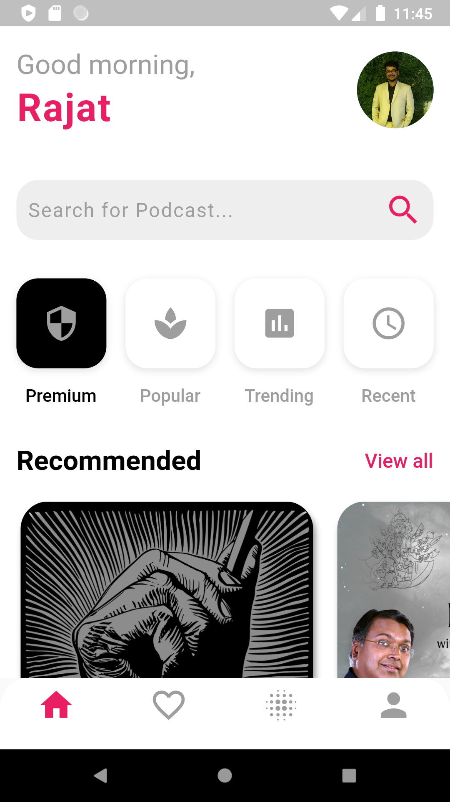
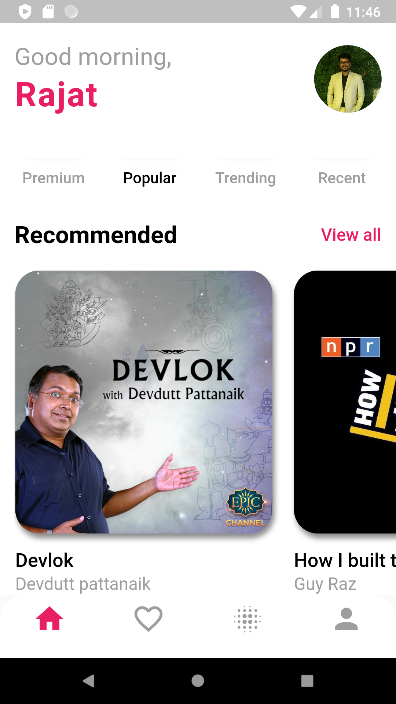
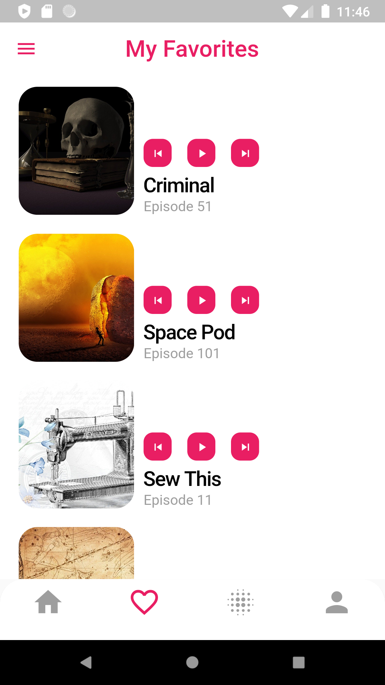
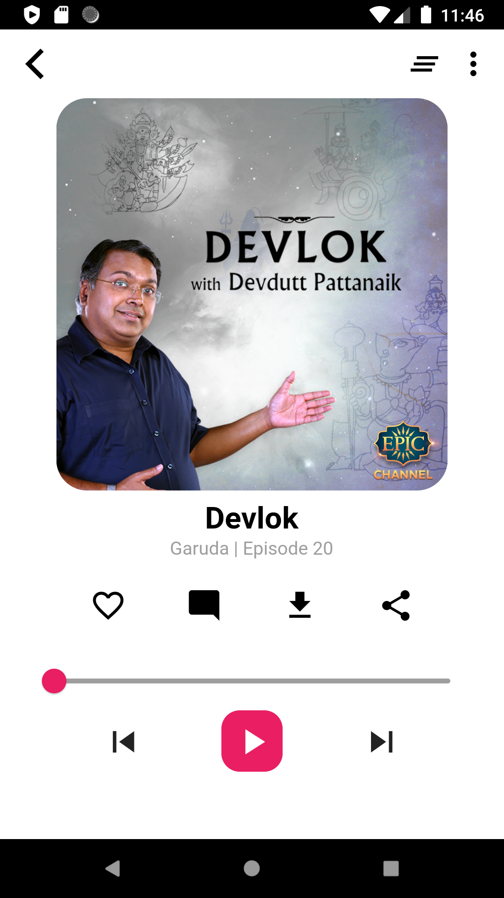
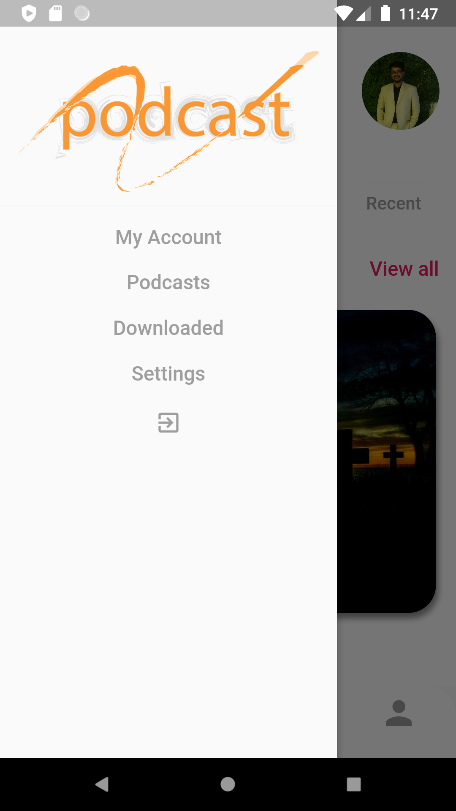

# Podcast UI 

I Tried implementing this beautiful Podcast UI designed by Fereshteh, Please find her work here :
https://dribbble.com/FereshtehPb

## About the Project

This Project is developed using Flutter & Dart. Purpose of the project is to develop a User friendly UI with smooth transitions between pages. This took 2 days to implement with working implementation of the application.

### Key Features : 

1. Custom Implementation of the Inherited Widget class.  
2. Extensive use of Global key.  
3. PageRouteBuilder & HERO animation for transitioning between Pages.  

### Lined up Changes :

1. Adding Animations when a new Page is pushed to the Screen. 
2. Animated Icons  
3. Use of Streams & Bloc Pattern.  

## Contact Info:

Add me on LinkedIn : https://www.linkedin.com/in/rajat-dabral/
Follow me on Quora : https://www.quora.com/profile/Rajat-Dabral

# Screen Shots: 

## Home Screen: 

  

  

## Favorite Screen:

  

## Player Screen:

  

## Drawer Menu: 

 

